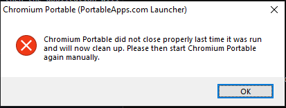
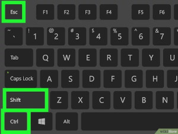
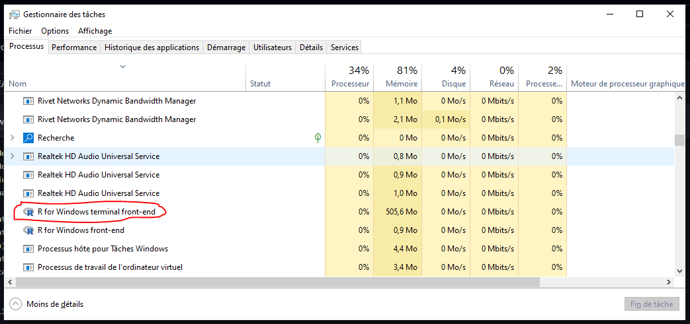

# CP-Seeker application

## How to install and run this application

### Windows
For Windows users, we created one file to click to be able to run our application.
So you just have to click on the file `CP-Seeker.bat`, then the application will run normaly, opening a new internet window.
If you want it directly on your desk, right click on this file and create a new shortcut on it.

### Ubuntu/Linux
For Ubuntu or Linux users, you will need to open a terminal and write some command lines :
```{bash}
cd my_path_of_CPSeeker
./R-Portable/bin/R.exe
```

This will open to you the R command line tool from our R portable folder which is directly in CP-Seeker. You now need to run the application by writing :
```{R}
source("./utils/manager.R")
```

Now all the application should run and open in a new internet window.

## Known bug(s)

### Crash when start

Sometimes, it can crash if you didn't closed correctly your last session. You will have this windiw and the application will stop.
<p align="center" width="100%">
     
</p>


If you have this, you have to go in your Taks Manager. To be able to open it, just click simultanely on CTRL + SHIFT + ECHAP :
<p align="center" width="100%">
     
</p>

Once it is open, you have to find `R for Windows terminal front-end` and ending this task !
<p align="center" width="100%">
     
</p>

Now you can launch again your application and it should work fine.
